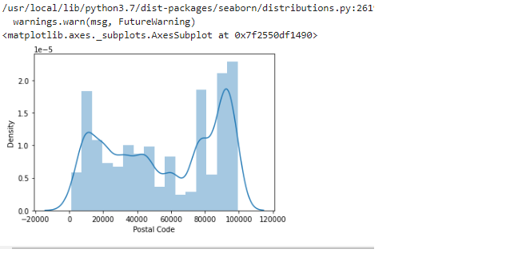

# Ex03-Univariate-Analysis

# Aim:
To detect the Univariate Analysis by using default functions.

# Algorithm:
1.Import pandas(),numpy()and seaborn() for a required detection.

2.use the head()

3.The information and is null function.

Use the describe function.
5.Figure the boxplot.

6.plot the countrplot,Displot,Histoplot.

7.Print the program.

 #  Program:

 ```

 import pandas as pd
import numpy as np
import seaborn as sns

data=pd.read_csv('SuperStore.csv')
data

data.head()

data.info()

data.describe()

data.isnull().sum()

data.dtypes

data['Postal Code'].value_counts()

sns.boxplot(x='Postal Code', data=data)

sns.countplot(x='Postal Code',data=data)

sns.distplot(data["Postal Code"])

sns.histplot(x='Postal Code',data=data)

```

# Output

### READFILE


### HEAD


### INFO


### DESCRIBE


### ISNULL


### DTYPES


### COUNT


### BOXPLOT


### COUNTER PLOT


### DISPLOT



### HISTPLOT


# RESULT

Hence the univariate analyses is verified.


